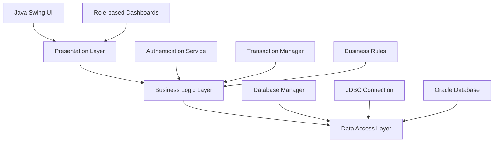

<div align="center">

# 🏦 KNB.inc Bank Management System


### 🚀 Enterprise-Grade Banking System with Role-Based Dashboards

A **comprehensive, multi-user banking application** built with **Java Swing** and **Oracle DB**. Features distinct, role-based dashboards for clients, managers, and admins, all within a secure **3-tier architecture**. This system expertly simulates real-world banking operations, making it a robust educational and demonstration project.

</div>

---

## 📖 **Project Overview**

KNB.inc Bank Management System is a **feature-rich, enterprise-grade banking simulation** that demonstrates advanced Java programming concepts, database design, and GUI development. The system implements real-world banking workflows with comprehensive user management, transaction processing, audit logging, and reporting capabilities.

### 🎯 **Core Objectives**
- **Simulate real banking operations** with multiple user roles
- **Demonstrate 3-tier architecture** (Presentation → Business → Data)
- **Implement secure authentication** and role-based access control  
- **Showcase advanced Java Swing** GUI development
- **Practice enterprise database design** with Oracle integration

---

## 🌟 **Key Features**

<table>
<tr>
<td width="33%">

### 👤 **Client Dashboard**
- 💰 View account balances & summaries
- 📄 Generate mini & detailed statements  
- 🔄 Fund transfer (intra-bank)
- 💵 Deposit & withdrawal operations
- 🧾 Pay utility bills
- 📱 Update contact details
- 🔐 Reset password functionality
- 📊 Download account statements

</td>
<td width="33%">

### 🛡️ **Admin Dashboard**
- 👥 Complete user management
- 🏦 Account creation & management
- 🔧 Role assignment (admin/manager/client)
- ✅ Approve/reject account requests
- 📈 Monitor audit logs & activities
- 📋 Generate system reports
- 🔄 Backup/restore operations
- 🚨 System monitoring & alerts

</td>
<td width="33%">

### 📊 **Manager Dashboard**
- 🏢 Branch-wide customer summaries
- 💸 Approve large transactions
- 🔍 Review suspicious activities
- 📉 Manage branch limits & liquidity
- 👨‍💼 Staff approval workflows
- 📝 KYC compliance handling
- 📊 Branch performance metrics
- 🎯 Risk management tools

</td>
</tr>
</table>

---

## 🏗️ **Project Structure**

```plaintext
KNB.inc/
├── bin/                          # Compiled .class output files
├── db/                           # Database setup scripts and documentation
│   └── schema.sql               # Oracle SQL script for table and sequence creation
├── lib/                         # External libraries
│   └── ojdbc8.jar              # Oracle JDBC Driver
└── src/                         # Java source code
    └── com/
        └── knb/
            ├── MainApp.java                    # Main entry point
            ├── model/                          # Data Model classes
            │   ├── Account.java               # Account entity
            │   ├── AuditEntry.java           # Audit log entity  
            │   ├── Transaction.java          # Transaction entity
            │   └── User.java                 # User entity
            ├── service/                        # Business Logic
            │   ├── AuthenticationService.java # Authentication & authorization
            │   ├── DatabaseManager.java       # Database connection & operations
            │   └── TransactionManager.java    # Transaction processing logic
            └── view/                           # GUI classes
                ├── LoginUI.java               # Login interface
                ├── WelcomeUI.java            # Welcome screen
                ├── Theme.java                # UI theme configuration
                ├── common/                    # Shared UI components
                │   └── LogoPanel.java        # Company logo panel
                ├── admin/                     # Admin interface
                │   └── AdminDashboard.java   # Admin dashboard
                ├── manager/                   # Manager interface
                │   └── ManagerDashboard.java # Manager dashboard
                └── client/                    # Client interface
                    └── ClientDashboard.java  # Client dashboard
```

---

## 🛠️ **Technology Stack**

<div align="center">

### **Core Technologies**


### **Architecture & Design**


</div>

| **Component**       | **Technology**           | **Purpose**                    |
|:------------------|:------------------------|:------------------------------|
| **Language**      | Java (JDK 8+)           | Core application development   |
| **GUI Framework** | Java Swing              | Desktop user interface         |
| **Database**      | Oracle Database XE      | Data persistence & management  |
| **Connectivity** | JDBC (ojdbc8.jar)       | Database connection layer      |
| **Architecture** | 3-Tier MVC              | Separation of concerns         |
| **Build System** | Manual compilation      | Simple build process           |
| **OS Support**   | Linux, Windows          | Cross-platform compatibility   |

---

## 🚀 **Installation & Setup**

### **Prerequisites**
- ☕ Java JDK 8 or higher
- 🗄️ Oracle Database XE 
- 💻 Windows or Linux operating system

### **Step-by-Step Installation**

#### **1. Database Setup**
```sql
-- Install Oracle Database XE on localhost:1521/XE
-- Execute the schema creation script
@db/schema.sql
COMMIT;
```

#### **2. JDBC Driver Configuration**
```bash
# Download ojdbc8.jar and place in lib/ directory
wget https://download.oracle.com/otn-pub/otn_software/jdbc/ojdbc8.jar
mv ojdbc8.jar lib/
```

#### **3. Database Connection Configuration**
Edit `src/com/knb/service/DatabaseManager.java`:
```java
String user = "your_oracle_username";
String pass = "your_oracle_password";
```

#### **4. Compilation (Linux/macOS)**
```bash
mkdir -p bin
javac -cp lib/ojdbc8.jar -d bin $(find src -name "*.java")
```

#### **5. Execution**
```bash
java -cp bin:lib/ojdbc8.jar com.knb.MainApp
```
*Note: On Windows, replace `:` with `;` in the classpath*

---

## 🔐 **Default Login Credentials**

| **Role**    | **Username**     | **Password** | **Access Level**        |
|:-----------|:-----------------|:-------------|:----------------------|
| **Admin**  | `Prak`           | `prak05`     | Full system access     |
| **Manager**| `Adithya Baiju`  | `adi05`      | Branch management      |

*Note: These are demonstration credentials for testing purposes*

---

## 🏗️ **Architecture & Design**

### **Development Model**
- **Spiral Model**: Iterative, risk-driven development approach
- **3-Tier Architecture**: Clear separation of presentation, business logic, and data layers

### **Layer Structure**


### **Design Patterns Used**
- **MVC (Model-View-Controller)**: Separation of data, presentation, and control logic
- **DAO (Data Access Object)**: Abstract data access operations
- **Singleton**: Database connection management
- **Factory**: UI component creation

---

## 📊 **System Features**

### **Authentication & Security**
- 🔐 Secure login with role-based access control
- 🛡️ Password encryption and validation
- 📝 Comprehensive audit logging
- 🚫 Session management and timeout handling

### **Transaction Processing**
- 💰 Real-time fund transfers
- 📊 Transaction history and reporting  
- ✅ Multi-level approval workflows
- 🔄 Automatic balance updates

### **Administrative Functions**
- 👥 User lifecycle management
- 🏦 Account creation and maintenance
- 📈 System monitoring and reporting
- 🔧 Configuration management

---

## 🔮 **Future Enhancements**

### **Planned Features**
- [ ] **Interbank Fund Transfer**: External bank integration
- [ ] **SMS/Email Notifications**: Real-time transaction alerts  
- [ ] **Advanced Encryption**: Enhanced security protocols
- [ ] **Web Interface**: Spring Boot + Angular implementation
- [ ] **Mobile App**: React Native mobile application
- [ ] **API Integration**: RESTful web services
- [ ] **Advanced Analytics**: Business intelligence dashboards
- [ ] **Multi-language Support**: Internationalization

### **Technical Improvements**
- [ ] **Microservices Architecture**: Service decomposition
- [ ] **Cloud Deployment**: AWS/Azure integration
- [ ] **Automated Testing**: Unit and integration tests
- [ ] **CI/CD Pipeline**: Automated build and deployment

---

## 🧪 **Testing**

### **Test Scenarios**
- ✅ User authentication and authorization
- ✅ Fund transfer operations
- ✅ Account management workflows
- ✅ Audit logging functionality
- ✅ Error handling and validation

### **Testing Environment**
```bash
# Run test scenarios
java -cp bin:lib/ojdbc8.jar com.knb.MainApp
# Test with different user roles
# Verify transaction processing
# Check audit trail generation
```

---

## 📝 **Documentation**

### **Available Resources**
- 📚 **Technical Specification**: Complete system documentation
- 🎯 **User Manual**: End-user operation guide
- 🔧 **Installation Guide**: Setup and configuration instructions
- 📊 **Database Schema**: Entity relationship diagrams
- 🎨 **UI/UX Design**: Interface design specifications

---

## 🤝 **Contributing**

We welcome contributions to improve the KNB.inc Bank Management System!

### **How to Contribute**
1. 🍴 Fork the repository
2. 🌿 Create a feature branch (`git checkout -b feature/AmazingFeature`)
3. 💻 Commit your changes (`git commit -m 'Add some AmazingFeature'`)
4. 📤 Push to the branch (`git push origin feature/AmazingFeature`)
5. 🔄 Open a Pull Request

### **Contribution Guidelines**
- Follow Java coding conventions
- Add comprehensive comments
- Include unit tests for new features
- Update documentation as needed

---

## 📄 **License**

This project is licensed under the **MIT License** - see the [LICENSE](LICENSE) file for details.

---

## 👤 **Author**

<div align="center">

**Prakhar Sharma**  
*AI Architect & System Programmer*

[](https://github.com/prak05)
[](https://linkedin.com/in/prak05-btech)
[](mailto:praksediting5@gmail.com)

</div>

---

## 🙏 **Acknowledgments**

- **Oracle Corporation** for the robust database system
- **Java Community** for comprehensive documentation
- **RIET Faculty** for technical guidance and support
- **Open Source Community** for inspiration and best practices

---

<div align="center">

### 🌟 **If you found this project helpful, please consider giving it a star!** ⭐

*Built with ❤️ for the developer community*

</div>